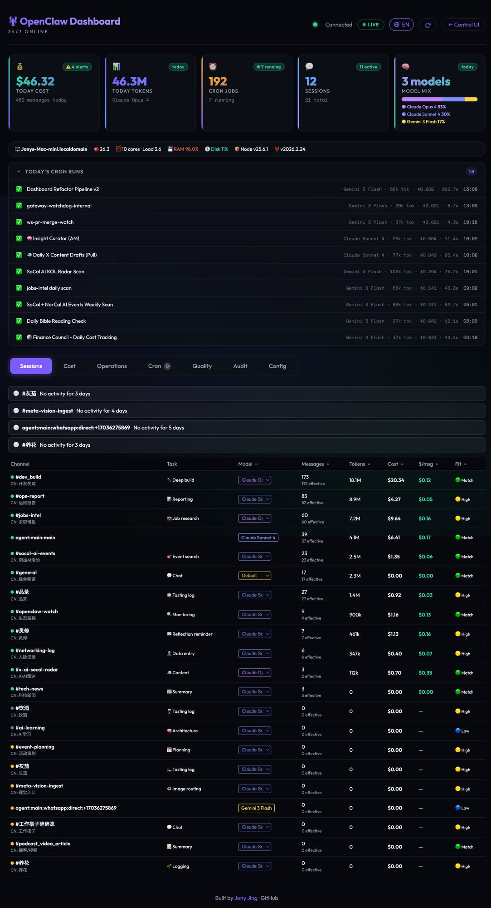
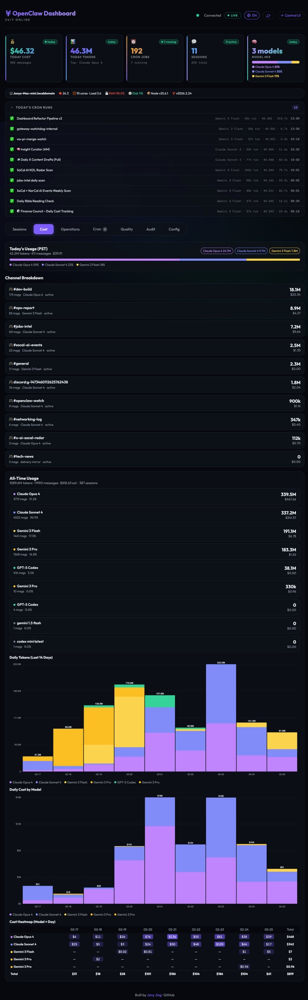
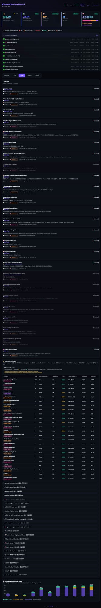
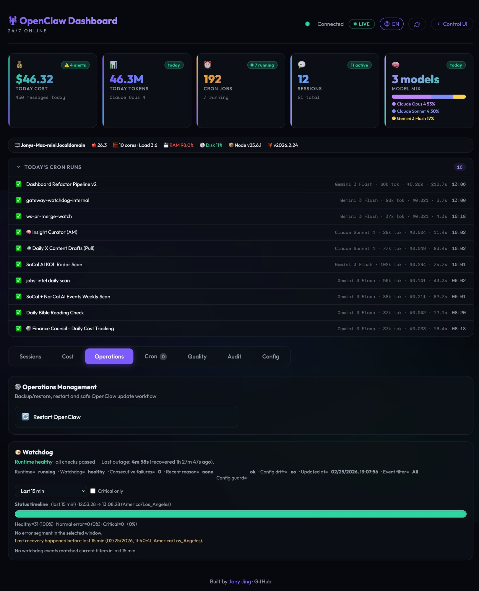

# OpenClaw Dashboard

A real-time operations dashboard for [OpenClaw](https://github.com/openclaw/openclaw) — monitor your AI agents, track costs, manage cron jobs, and watch system health from one interface.

 

---

## Installation via OpenClaw

The easiest way is to tell your OpenClaw agent:

> **"Install the openclaw-dashboard skill"**

OpenClaw will automatically install and configure the dashboard. After installation, start the server:

```bash
cd ~/.openclaw/workspace/skills/openclaw-dashboard
cp env.example .env
# Edit .env — set OPENCLAW_AUTH_TOKEN
node api-server.js
```

Open `http://localhost:18791/` in your browser.

### Manual Install

```bash
git clone https://github.com/JonathanJing/openclaw-dashboard.git
cd openclaw-dashboard
cp env.example .env
# Edit .env — set OPENCLAW_AUTH_TOKEN at minimum
node api-server.js
```

---

## What It Does

OpenClaw Dashboard gives you a live window into your running OpenClaw gateway. It reads session logs, cron history, and watchdog state directly from `~/.openclaw/` and presents them in five panels.

---

## Overview Tab — Sessions & Alerts



**What you see:**
- **5 stat cards**: today's cost, total tokens, active cron jobs, active sessions, model mix breakdown
- **Today's Cron Runs** — collapsible log of every scheduled job with model, tokens, cost, and time
- **System info bar** — hostname, macOS, CPU, load, RAM %, disk %, Node and OpenClaw versions
- **Session alerts** — flags over-spec (wasting money) or under-spec sessions automatically
- **Sessions table** — every active channel with model selector, message count, tokens, cost, $/msg, and fit score
- **Language toggle** (top-right `EN` button) — switch entire UI between English and Chinese

---

## Cost Tab — Spend Analysis



**What you see:**
- **Today's usage** with model breakdown pills
- **Channel Breakdown** — per-channel token and dollar spend
- **All-Time Usage** — lifetime totals by model (Opus / Sonnet / Flash / GPT / Gemini)
- **Daily Tokens chart** — 14-day stacked bar chart by model
- **Daily Cost chart** — dollar spend per day by model
- **Cost Heatmap** — model × day matrix showing where spend concentrates

---

## Cron Tab — Scheduled Jobs



**What you see:**
- All configured cron jobs with schedule, description, last run status, and model
- **Inline model selector** — change the LLM for any job without editing config files
- **Cost Analysis** — per-job lifetime cost, avg tokens/run, avg $/run, today's spend
- **Run History** — per-job daily breakdown for last 7 days
- **Trend chart** — fixed baseline vs. variable cost over time

---

## Health Tab — Watchdog, Quality & Audit



**What you see:**
- **Session Quality** — silence rate per channel (NO_REPLY + HEARTBEAT_OK / total). High silence = consider downgrading model to save cost
- **Audit** — live provider API status (OpenAI / Anthropic / Google) with request counts
- **Config Audit** — per-channel model recommendations with over/under-spec flags
- **System Info** — full system details + dashboard uptime
- **Operations** — one-click Backup + Push, Restart (when enabled via env)
- **Watchdog** — live gateway health with:
  - Status pills: Running state / failure count / config drift detection
  - **24h uptime bar** — color-coded blocks (green=healthy, yellow=degraded, red=down)
  - **Incident log** — grouped outage events with duration, reason, and recovery time

---

## Configuration

Copy `env.example` to `.env` and edit.

### Core

| Variable | Default | Description |
|---|---|---|
| `OPENCLAW_AUTH_TOKEN` | *(none)* | Dashboard access token. Always set this. |
| `DASHBOARD_HOST` | `127.0.0.1` | Bind address. Keep localhost unless using a tunnel. |
| `DASHBOARD_PORT` | `18791` | Port to serve on. |

### Opt-in Features

| Variable | What it enables |
|---|---|
| `OPENCLAW_ENABLE_MUTATING_OPS=1` | Backup, restore, update, and model-change actions |
| `OPENCLAW_LOAD_KEYS_ENV=1` | Load `~/.openclaw/keys.env` on startup |
| `OPENCLAW_ENABLE_PROVIDER_AUDIT=1` | Fetch live usage from OpenAI / Anthropic org APIs |
| `OPENCLAW_ENABLE_CONFIG_ENDPOINT=1` | Expose `/ops/config` read endpoint |
| `OPENCLAW_ENABLE_SYSTEMCTL_RESTART=1` | Allow user-scoped systemctl restart |

### Remote Access

If exposing beyond localhost (e.g. Tailscale Funnel), always set auth token and CORS:

```env
OPENCLAW_AUTH_TOKEN=your_token_here
DASHBOARD_CORS_ORIGINS=https://your-tailscale-host.ts.net
```

---

## Security Notes

- Binds to `localhost` by default
- Auth stored in HttpOnly cookie after login — not in URL params
- All subprocess calls use `execFileSync` with args array (no shell injection)
- Mutating operations require `OPENCLAW_ENABLE_MUTATING_OPS=1` AND a localhost origin
- Never commit `.env` or your auth token

---

## Files

| File | Description |
|---|---|
| `agent-dashboard.html` | Single-file frontend |
| `api-server.js` | Backend API server |
| `SKILL.md` | OpenClaw agent install instructions |
| `env.example` | Environment variable template |

---

## License

MIT — built by [Jony Jing](https://github.com/JonathanJing)
