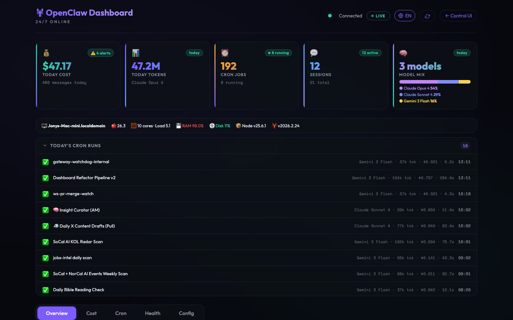
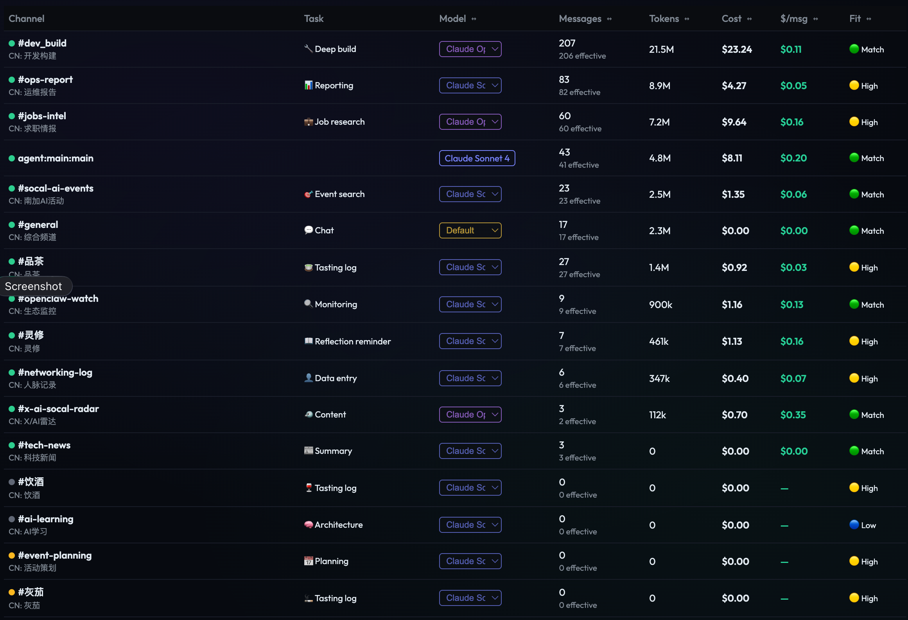
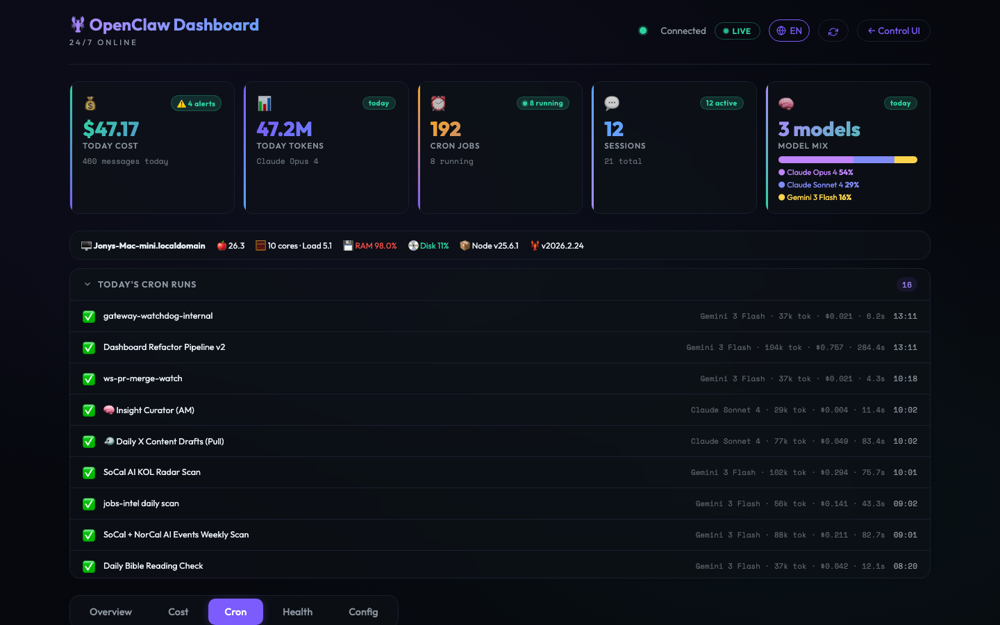
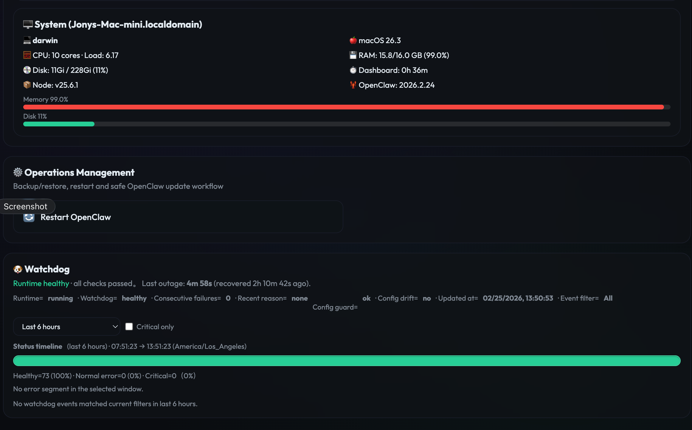
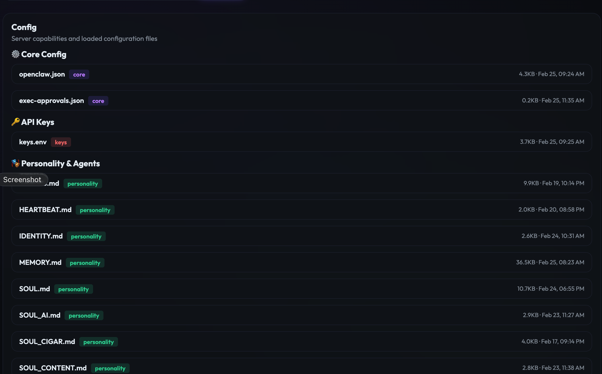

# OpenClaw Dashboard

A single-file, zero-dependency web dashboard for monitoring and managing your [OpenClaw](https://github.com/openclaw/openclaw) personal AI agent.

Built as one HTML file + one Node.js API server. No build step. No frameworks. Just open and go.

## Features

### 📊 Overview
Real-time session monitoring across all channels. See token usage, cost, model allocation, and "Fit" scores that flag model/task mismatches. Inline model selectors let you switch models per-channel without touching config files.



### 💰 Cost
Today's per-channel breakdown with model distribution bars. All-time usage with daily token/cost trend charts and a cost heatmap for anomaly detection. Per-provider cache-aware pricing with automatic cost estimation.



### ⏰ Cron
Manage 20+ cron jobs from one panel. See status, schedule, model, last run time. Inline model selectors for cost optimization. Cron Cost Analysis breaks down per-job costs with fixed vs. variable trend charts.



### 🏥 Health
Three sub-panels in one tab:
- **Watchdog** — Gateway uptime timeline with gradient visualization, event filtering, and critical-only mode
- **Quality** — Per-channel silence rates (NO_REPLY + HEARTBEAT_OK) to identify wasteful model assignments
- **Audit** — Model-channel optimization suggestions and system information



### ⚙️ Config
- **Configuration viewer** — Browse openclaw.json, keys.env, SOUL.md with key masking
- **Document editor** — View and edit workspace files with Markdown preview



## Quick Start

```bash
# Clone
git clone https://github.com/JonathanJing/openclaw-dashboard.git
cd openclaw-dashboard

# Configure
cp .env.example .env  # Edit with your OpenClaw auth token

# Run
node api-server.js
# → http://localhost:18791
```

### Environment Variables

| Variable | Required | Description |
|----------|----------|-------------|
| `OPENCLAW_AUTH_TOKEN` | Yes | Your OpenClaw gateway auth token |
| `DASHBOARD_PORT` | No | Port (default: 18791) |
| `OPENCLAW_WORKSPACE` | No | Workspace path (default: `~/.openclaw/workspace`) |
| `OPENCLAW_ENABLE_MUTATING_OPS` | No | Enable restart/backup/update buttons |

## Architecture

```
agent-dashboard.html  ← Single-file frontend (~3800 lines, inline CSS/JS)
api-server.js         ← Node.js HTTP server (~2700 lines, zero dependencies)
```

- **Zero dependencies** — Uses only Node.js built-in modules (`http`, `fs`, `child_process`)
- **Security** — Token auth, CORS loopback-only, `execFileSync` (no shell injection), mutating ops guard
- **i18n** — Full English/Chinese toggle with `localStorage` persistence
- **Single-file philosophy** — No build step, no bundler, no framework. Copy two files and run.

## API Endpoints

| Endpoint | Description |
|----------|-------------|
| `GET /health` | Health check (no auth) |
| `GET /ops/sessions` | Channel session details with token/cost |
| `GET /ops/channels` | Today's per-channel usage |
| `GET /ops/alltime` | Historical usage trends |
| `GET /ops/cron-costs` | Per-cron cost analysis |
| `GET /ops/watchdog` | Gateway watchdog status |
| `GET /ops/models` | Model config and pricing |
| `GET /ops/config` | Configuration files (masked) |
| `GET /ops/system` | System info (hardware, disk, memory) |
| `POST /ops/session-model` | Change channel model |
| `POST /ops/cron-model` | Change cron job model |
| `GET /cron` | Cron job management |
| `GET /agents` | Active session monitor |
| `GET /files` | Workspace file browser |
| `POST /backup` | Git backup + push |

## License

MIT
