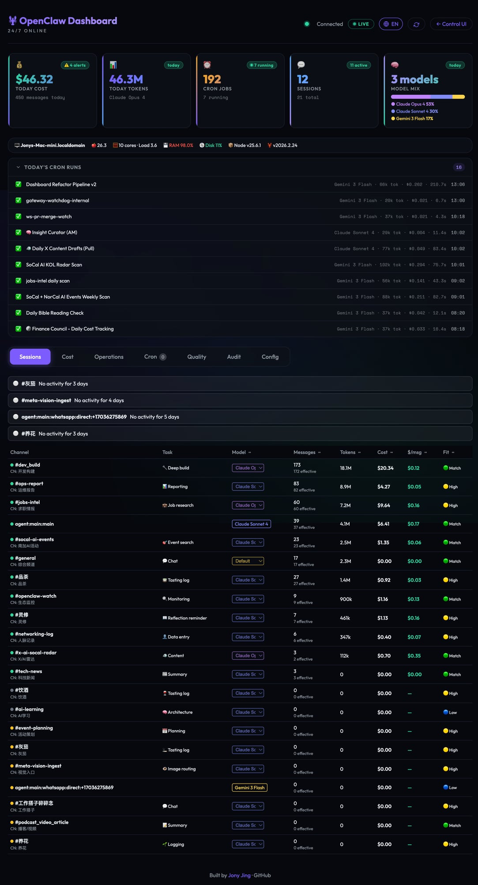
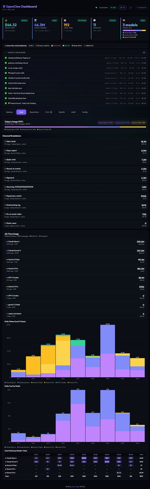
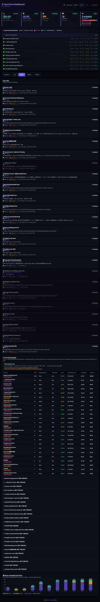
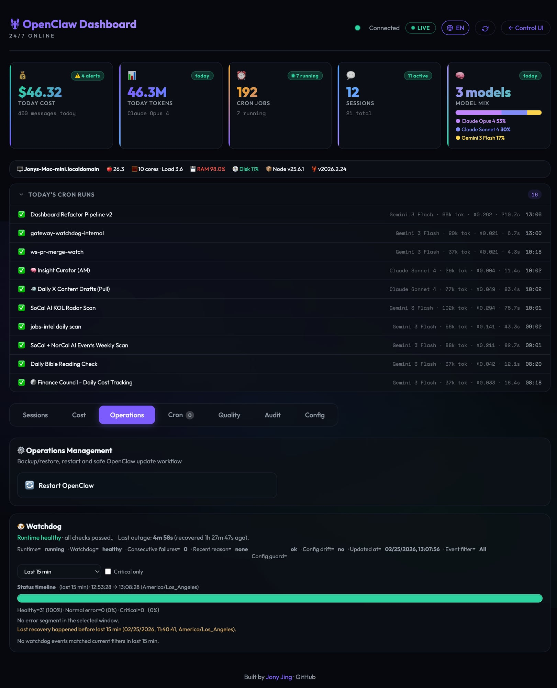

# OpenClaw Dashboard

A real-time operations dashboard for OpenClaw — built for teams running multi-agent workflows in production.

It helps you answer, fast:
- Is the system healthy right now?
- Where are tokens and cost going?
- Which cron job or agent needs attention first?

---

## Screenshots

| Overview | Cost | Cron | Health |
|---|---|---|---|
|  |  |  |  |

---

## Why OpenClaw Dashboard

Most AI dashboards stop at pretty charts.  
OpenClaw Dashboard is designed for **operational decisions**:
- top-level signals (cost, tokens, alerts, model mix, infra state)
- deep drill-down per session / channel / cron job
- architecture readable by both humans and agents

---

## Architecture (v2.0)

v2.0 replaced the monolithic `api-server.js` + `agent-dashboard.html` with a **modular backend + tab-based frontend**.

```
backend/
  server.js              ← thin HTTP router shell
  lib/
    config.js            ← all paths and env vars
    http-helpers.js      ← auth, CORS, JSON helpers
    sqlite-helper.js     ← safe SQLite query wrapper
  providers/
    sessions.js          ← /ops/sessions — session stats + model
    ledger.js            ← /ops/ledger/* — token/cost from SQLite
    cron.js              ← /ops/cron, /ops/cron-costs, /cron/today
    watchdog.js          ← /ops/watchdog — health timeline
    spark.js             ← /ops/dgx-status — local inference node
    system.js            ← /ops/system — CPU/RAM/disk
    ground-truth.js      ← /ops/models — model registry + colors
    tasks.js             ← /tasks — task CRUD + notes
    config.js            ← /ops/config, /files, /skills
    ops-legacy.js        ← /ops/* remaining — audit, channels, restart

frontend/
  index.html             ← shell (loads tabs as <script> modules)
  shared/
    api.js               ← auth, apiFetch(), watchdog renderers, toast, markdown
    ui-utils.js          ← timeSince(), task state
    boot.js              ← init, charts, confirm dialog
    styles.css           ← dark theme
  tabs/
    overview.js          ← Sessions table + Tasks list
    cost.js              ← Channel breakdown + all-time charts
    cron.js              ← Cron jobs + cost analysis + trend chart
    health.js            ← System info + DGX Spark + Watchdog
    config.js            ← Config viewer + file editor + Skills

~/.openclaw/dashboard/   ← runtime data (NOT in Git)
  tasks.json
  attachments/
```

---

## Key Capabilities

### Overview
- Today cost / token usage + model mix
- Alert snapshot (sessions / cron / watchdog)
- DGX Spark active job + slot visibility
- Session table: model, tokens, cost, per-channel

### Cost Tab
- Model-level token + cost breakdown
- Channel-level drill-down
- Weekly/monthly charts with model stacking
- Cost heatmap (model × day)

### Cron Tab
- All cron jobs with last-run status and model selector
- Today's run timeline
- Per-job cost analysis: tokens/run, $/run, daily breakdown
- Fixed vs variable cost trend chart (30 days)

### Health Tab
- Host status: macOS, CPU, RAM, disk, Node, OpenClaw version
- DGX Spark: GPU util, temp, power, RAM, slot busy/total
- Watchdog: 24h uptime bar, incidents, downtime windows
- Operations: backup, restore, update, restart

### Config Tab
- Live config viewer (core / keys / personality files)
- Workspace file browser + markdown editor
- Installed skills list

---

## Quick Start

```bash
# 1. Install (or update)
clawhub install openclaw-dashboard

# 2. Configure
cd ~/.openclaw/workspace/skills/openclaw-dashboard
cp env.example .env
# Edit .env and set OPENCLAW_AUTH_TOKEN

# 3. Start
node backend/server.js
```

Open: `http://127.0.0.1:18791/`

First visit redirects to `/login` — paste your token once, then cookie auth takes over.

---

## Environment Variables

| Variable | Default | Description |
|---|---|---|
| `DASHBOARD_PORT` | `18791` | Port to listen on |
| `DASHBOARD_HOST` | `127.0.0.1` | Bind address |
| `OPENCLAW_AUTH_TOKEN` | *(none)* | Auth token (required for non-loopback) |
| `OPENCLAW_DASHBOARD_TASKS` | `~/.openclaw/dashboard/tasks.json` | Task data path |
| `OPENCLAW_ENABLE_MUTATING_OPS` | `0` | Enable model switch, backup, update ops |
| `OPENCLAW_ENABLE_CONFIG_ENDPOINT` | `0` | Expose `/ops/config` |
| `DASHBOARD_CORS_ORIGINS` | loopback only | Comma-separated allowed origins |

See `env.example` for the full list.

---

## Runtime Data

Task data and attachments are stored **outside the skill directory** so they are never accidentally committed:

```
~/.openclaw/dashboard/
  tasks.json        ← task list
  attachments/      ← file uploads
```

Override with `OPENCLAW_DASHBOARD_TASKS` env var if needed.

---

## Security

- **Local-first**: binds to `127.0.0.1` by default
- **Token auth**: HttpOnly cookie after first login; `Authorization: Bearer` header also accepted
- **Mutating ops disabled** by default: model switches, backup, update require `OPENCLAW_ENABLE_MUTATING_OPS=1`
- **No secrets in source**: all sensitive values via env vars
- **CORS**: loopback-only by default; use `DASHBOARD_CORS_ORIGINS` for Tailscale/remote access

---

## Who This Is For

- Builders running always-on agent systems
- Operators managing cron-heavy AI workflows
- Teams needing both observability and operational control

---

## License

MIT
